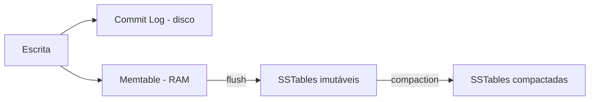

# Cassandra Applications

> O Apache Cassandra é um banco **NoSQL distribuído, orientado a colunas (wide-column)**, projetado para lidar com **volumes gigantescos de escrita**, **alta disponibilidade (sem ponto único de falha)** e **escalabilidade horizontal linear** inclusive entre vários data centers espalhados pelo mundo.

**Por que o Cassandra escala tão bem?**
* **Arquitetura sem mestre (masterless / peer-to-peer)**: todos os nós são iguais e organizados em um **anel**. Qualquer nó pode receber leituras e escritas se um cai, os outros continuam atendendo.
* **Particionamento por hash consistente**: a **partition key** passa por uma função de hash (Murmur3) que define em qual nó o dado mora. Adicionar nós redistribui os dados automaticamente.
* **Replicação configurável**: cada dado é copiado para `RF` nós (Replication Factor, normalmente 3), inclusive em data centers diferentes.
* **Consistência ajustável (tunable consistency)**: em cada consulta você escolhe quantas réplicas precisam responder (`ONE`, `QUORUM`, `LOCAL_QUORUM`, `ALL`…).
* **Escrita extremamente rápida (LSM Tree)**: a escrita vai para o **Commit Log** (disco, sequencial) + **Memtable** (RAM) e depois é descarregada em **SSTables** imutáveis. Não há "procurar e atualizar no lugar" como em bancos relacionais.



> ⚠️ **Teorema CAP:** o Cassandra prioriza **Disponibilidade (A)** e **Tolerância a Partições (P)**, oferecendo **consistência eventual** que pode ser "endurecida" escolhendo níveis como `QUORUM`.

> ⚠️ **Modelagem orientada a consultas (query-driven):** no Cassandra **não existem JOINs** e só é possível filtrar eficientemente pela chave primária. Por isso, modela-se **uma tabela por consulta**, aceitando **duplicar dados** (desnormalização). Primeiro você pensa "quais perguntas a aplicação vai fazer?", depois cria as tabelas.

### Anatomia da chave primária (o conceito mais importante)
```sql
PRIMARY KEY ((sensor_id, dia), ts)
--           └── partition key ──┘  └ clustering column
```
* **Partition key** → define **em qual nó** o dado fica. Toda consulta deve informá-la.
* **Clustering columns** → definem a **ordem** das linhas **dentro** da partição (permitem filtros de intervalo `>`, `<`, `ORDER BY`).

---

## 1. Séries Temporais e IoT (O mais clássico)
Sensores, medidores e dispositivos enviam leituras o tempo todo milhões de escritas por segundo, quase nunca atualizadas, consultadas por intervalo de tempo.

* Exemplo: Uma fazenda inteligente com milhares de sensores de temperatura e umidade enviando dados a cada segundo. O painel mostra as leituras das últimas horas de cada sensor.

```sql
CREATE KEYSPACE iot
  WITH replication = {'class': 'NetworkTopologyStrategy', 'dc1': 3};

CREATE TABLE iot.leituras_por_sensor (
    sensor_id   text,
    dia         date,          -- "bucket" para a partição não crescer sem limite
    ts          timestamp,
    temperatura double,
    umidade     double,
    PRIMARY KEY ((sensor_id, dia), ts)
) WITH CLUSTERING ORDER BY (ts DESC)          -- mais recentes primeiro
  AND default_time_to_live = 7776000          -- apaga sozinho após 90 dias
  AND compaction = {'class': 'TimeWindowCompactionStrategy',
                    'compaction_window_unit': 'DAYS',
                    'compaction_window_size': 1};

INSERT INTO iot.leituras_por_sensor (sensor_id, dia, ts, temperatura, umidade)
VALUES ('estufa-07', '2026-10-07', toTimestamp(now()), 27.4, 61.0);

SELECT ts, temperatura FROM iot.leituras_por_sensor
WHERE sensor_id = 'estufa-07' AND dia = '2026-10-07'
  AND ts >= '2026-10-07 08:00:00'
LIMIT 100;
```

**Cuidados:**
* **Bucketing**: sem o campo `dia` na partition key, a partição de um sensor cresceria para sempre (**partição gigante / hot partition**). Recomenda-se manter partições abaixo de ~100 MB.
* **TTL** + **TimeWindowCompactionStrategy (TWCS)**: dados antigos expiram e são descartados em blocos inteiros, sem custo de limpeza.


## 2. Histórico de Mensagens e Chats
Aplicativos de mensagem armazenam **bilhões de mensagens** que são escritas uma vez e lidas em ordem cronológica, por conversa.

* Exemplo: O **Discord** armazenou trilhões de mensagens no Cassandra por anos (depois migrou para o ScyllaDB, compatível com Cassandra). Ao abrir um canal, carregam-se as 50 mensagens mais recentes; ao rolar para cima, as anteriores.

```sql
CREATE TABLE chat.mensagens_por_canal (
    canal_id    uuid,
    bucket      int,           -- ex.: semana/mês, limita o tamanho da partição
    mensagem_id timeuuid,      -- UUID que carrega o timestamp (ordenável)
    autor_id    uuid,
    conteudo    text,
    PRIMARY KEY ((canal_id, bucket), mensagem_id)
) WITH CLUSTERING ORDER BY (mensagem_id DESC);

INSERT INTO chat.mensagens_por_canal (canal_id, bucket, mensagem_id, autor_id, conteudo)
VALUES (8a1c..., 202641, now(), 3f9e..., 'Olá, pessoal!');

-- Paginação "rolar para cima": mensagens anteriores a uma mensagem já exibida
SELECT * FROM chat.mensagens_por_canal
WHERE canal_id = 8a1c... AND bucket = 202641
  AND mensagem_id < 5b2e7c40-a69c-11f0-8de9-0242ac120002
LIMIT 50;
```

> 💡 `timeuuid` resolve dois problemas de uma vez: é **único** (duas mensagens no mesmo milissegundo não colidem) e **ordenável por tempo**.


## 3. Feeds de Atividade e Timelines (Redes Sociais)
Exibir a linha do tempo de um usuário precisa ser instantâneo, mesmo com centenas de milhões de usuários.

* Exemplo: Quando alguém publica um post, ele é copiado para a timeline de cada seguidor (**fan-out na escrita**). Assim, abrir o feed é uma única leitura em uma única partição. O **Instagram** já utilizou Cassandra para feeds e caixas de entrada.

```sql
CREATE TABLE social.timeline_por_usuario (
    usuario_id  uuid,
    postado_em  timeuuid,
    post_id     uuid,
    autor_nome  text,           -- dado duplicado de propósito (sem JOIN!)
    resumo      text,
    PRIMARY KEY ((usuario_id), postado_em)
) WITH CLUSTERING ORDER BY (postado_em DESC);

-- Feed do usuário: os 20 posts mais recentes
SELECT * FROM social.timeline_por_usuario WHERE usuario_id = 11aa... LIMIT 20;
```

> 💡 **Trade-off:** escrever mais (uma cópia por seguidor) para ler muito rápido. O Cassandra foi feito exatamente para escritas baratas. Para celebridades com milhões de seguidores, usa-se um modelo híbrido (fan-out na leitura).


## 4. Perfis, Personalização e Histórico de Consumo
Dados de usuário acessados **por chave**, com altíssima disponibilidade e baixa latência no mundo todo.

* Exemplo: A **Netflix** usa o Cassandra para guardar o **histórico de visualização** ("Continuar assistindo") e preferências de centenas de milhões de assinantes em várias regiões da AWS.

```sql
CREATE TABLE streaming.historico_por_usuario (
    usuario_id      uuid,
    assistido_em    timestamp,
    titulo_id       uuid,
    titulo          text,
    posicao_seg     int,         -- onde o usuário parou
    PRIMARY KEY ((usuario_id), assistido_em, titulo_id)
) WITH CLUSTERING ORDER BY (assistido_em DESC, titulo_id ASC);

CREATE TABLE streaming.preferencias (
    usuario_id uuid PRIMARY KEY,
    idiomas    set<text>,
    generos    map<text, int>,   -- gênero → peso de interesse
    perfis     list<text>
);

UPDATE streaming.preferencias
SET idiomas = idiomas + {'pt-BR'}, generos['ficcao'] = 9
WHERE usuario_id = 11aa...;
```

> 💡 **Coleções** (`set`, `list`, `map`) evitam tabelas auxiliares para dados pequenos. ⚠️ Não use coleções para listas que crescem sem limite.


## 5. Logs, Eventos e Auditoria
Registros **append-only** (só inserção), com volume enorme e necessidade de retenção por período.

* Exemplo: Trilha de auditoria de um banco digital: toda ação do cliente (login, PIX, alteração de limite) é registrada para conformidade regulatória e investigação.

```sql
CREATE TABLE auditoria.eventos_por_conta (
    conta_id   uuid,
    mes        text,            -- '2026-10'
    evento_id  timeuuid,
    tipo       text,
    ip         inet,
    detalhes   map<text, text>,
    PRIMARY KEY ((conta_id, mes), evento_id)
) WITH CLUSTERING ORDER BY (evento_id DESC);

INSERT INTO auditoria.eventos_por_conta (conta_id, mes, evento_id, tipo, ip, detalhes)
VALUES (77bc..., '2026-10', now(), 'PIX_ENVIADO', '200.10.1.5',
        {'valor': '150.00', 'destino': 'chave@email.com'})
USING TTL 157680000;        -- retenção de 5 anos
```


## 6. Detecção de Fraudes e Histórico de Transações
Sistemas antifraude precisam consultar, em milissegundos, o **comportamento recente** de um cartão ou cliente antes de aprovar uma compra.

* Exemplo: Antes de aprovar uma compra, o sistema busca as últimas transações do cartão (valores, cidades, horários) e compara com o padrão. Uma compra em São Paulo 10 minutos depois de outra em Lisboa é suspeita.

```sql
CREATE TABLE fraude.transacoes_por_cartao (
    cartao_hash text,
    ts          timestamp,
    valor       decimal,
    cidade      text,
    pais        text,
    PRIMARY KEY ((cartao_hash), ts)
) WITH CLUSTERING ORDER BY (ts DESC)
  AND default_time_to_live = 2592000;        -- janela de análise de 30 dias

SELECT ts, valor, cidade, pais FROM fraude.transacoes_por_cartao
WHERE cartao_hash = 'a1b2c3' AND ts > '2026-10-06 18:00:00';
```


## 7. Rastreamento e Logística em Tempo Real
Frotas de veículos e entregadores enviando posição GPS continuamente.

* Exemplo: App de delivery/mobilidade (a **Uber** é uma grande usuária de Cassandra) registra a posição do entregador a cada poucos segundos para exibir o trajeto ao cliente e calcular tempo estimado.

```sql
CREATE TABLE logistica.posicoes_por_entrega (
    entrega_id uuid,
    ts         timestamp,
    lat        double,
    lon        double,
    status     text,
    PRIMARY KEY ((entrega_id), ts)
) WITH CLUSTERING ORDER BY (ts DESC);

-- Última posição conhecida
SELECT lat, lon, status FROM logistica.posicoes_por_entrega
WHERE entrega_id = 9f0d... LIMIT 1;
```


## 8. Contadores Distribuídos
Contagens que recebem incrementos simultâneos de vários servidores.

* Exemplo: Visualizações de vídeos, curtidas de posts, cliques em anúncios.

```sql
CREATE TABLE midia.estatisticas_video (
    video_id      uuid PRIMARY KEY,
    visualizacoes counter,
    curtidas      counter
);

UPDATE midia.estatisticas_video
SET visualizacoes = visualizacoes + 1
WHERE video_id = 4d5e...;
```

> ⚠️ Em tabelas `counter`, **todas** as colunas fora da chave primária devem ser counters, não é possível usar `INSERT` nem TTL, e retentativas podem contar duas vezes (não é idempotente). Para contagem exata e atômica de alta frequência, o **Redis** (`INCR`) costuma ser mais adequado.


## 9. Unicidade com Lightweight Transactions (LWT)
Como o Cassandra é eventualmente consistente, dois usuários poderiam cadastrar o mesmo login ao mesmo tempo. Para casos pontuais, existe o **compare-and-set** via protocolo **Paxos**.

* Exemplo: Garantir que o nome de usuário `ana` seja único no sistema (equivalente ao `SET NX` do Redis).

```sql
INSERT INTO contas.usuarios_por_username (username, usuario_id, email)
VALUES ('ana', uuid(), 'ana@email.com')
IF NOT EXISTS;
-- [applied] = True  → cadastrado
-- [applied] = False → já existe, retorna a linha atual

UPDATE contas.saldos SET saldo = 80 WHERE conta_id = 77bc... IF saldo = 100;
```

> ⚠️ LWT exige várias idas e voltas entre réplicas (~4x mais lento). Use apenas onde a garantia for indispensável.


## 10. Aplicações Multi-Região e Alta Disponibilidade
Sistemas que **não podem parar** e precisam atender usuários em vários continentes com baixa latência.

* Exemplo: Carrinho de compras de um e-commerce global. Se um data center inteiro cair, o outro continua aceitando pedidos. A **Apple** opera um dos maiores clusters Cassandra do mundo.

```sql
CREATE KEYSPACE loja
  WITH replication = {'class': 'NetworkTopologyStrategy',
                      'sao_paulo': 3, 'virginia': 3, 'frankfurt': 3};

CONSISTENCY LOCAL_QUORUM;   -- (cqlsh) confirma em 2 de 3 réplicas do DC local
```

**Níveis de consistência mais usados:**
| Nível | Réplicas que precisam responder (RF = 3) | Uso |
|---|---|---|
| `ONE` | 1 | Máxima velocidade, tolera dados levemente desatualizados |
| `QUORUM` | 2 (maioria do cluster todo) | Equilíbrio entre consistência e disponibilidade |
| `LOCAL_QUORUM` | 2 no data center local | Padrão em clusters multi-região |
| `ALL` | 3 | Consistência máxima, mas falha se uma réplica cair |

> 💡 **Regra de ouro:** se `R + W > RF` (réplicas lidas + réplicas escritas > fator de replicação), a leitura sempre enxerga a última escrita. Ex.: `QUORUM` + `QUORUM` com RF 3 → 2 + 2 > 3 ✅.

---

## 🚫 Quando NÃO usar o Cassandra
| Situação | Por quê | Alternativa |
|---|---|---|
| Muitos JOINs e consultas ad-hoc | Só filtra bem pela chave primária | PostgreSQL / MySQL |
| Transações ACID entre várias tabelas | Não há transações multi-partição completas | Bancos relacionais |
| Volume pequeno de dados | Complexidade operacional não compensa | Bancos relacionais / MongoDB |
| Muitas exclusões e atualizações | Exclusões geram **tombstones** que degradam leituras | Outro modelo de dados |
| Relatórios analíticos / agregações | `GROUP BY`/`SUM` limitados | Spark + Cassandra, data warehouse |
| Cache de latência sub-milissegundo | Dados em disco | Redis |

> ⚠️ **`ALLOW FILTERING`** obriga o Cassandra a varrer partições inteiras (ou o cluster todo). Se você precisou dele, provavelmente falta uma tabela modelada para essa consulta.

---

## ⚖️ Redis × Cassandra
| | Redis | Cassandra |
|---|---|---|
| Modelo | Chave-valor em memória | Wide-column distribuído |
| Armazenamento | RAM (persistência opcional) | Disco (LSM Tree) |
| Ponto forte | Latência < 1 ms, estruturas ricas | Escrita massiva, petabytes, multi-DC |
| Escala | Vertical / Redis Cluster | Horizontal linear (adicionar nós) |
| Uso típico | Cache, sessões, filas, rankings | Séries temporais, histórico, logs, feeds |

> 💡 É comum usá-los **juntos**: o Cassandra guarda o histórico completo (fonte da verdade) e o Redis mantém em cache os dados quentes (ex.: últimas mensagens do chat, contador de visualizações em tempo real).

------------------------------
## 🛠️ Resumo de Como os Recursos se Encaixam

### Séries Temporais, IoT, Logs e Rastreamento
* **Partition key composta com bucket** (`(sensor_id, dia)`): distribui a carga e limita o tamanho das partições.
* **Clustering column de tempo + `CLUSTERING ORDER BY ... DESC`**: os mais recentes primeiro, consultas por intervalo.
* **TTL + TWCS**: expiração e limpeza automáticas.

### Chats e Feeds
* **`timeuuid`**: identificador único e ordenado por tempo.
* **Desnormalização / fan-out na escrita**: uma tabela por consulta, dados duplicados de propósito.

### Perfis e Personalização
* **Coleções (`set`, `list`, `map`)**: atributos pequenos e multivalorados na mesma linha.

### Contadores
* **Tipo `counter`**: incrementos distribuídos sem leitura prévia.

### Unicidade e Idempotência
* **Lightweight Transactions (`IF NOT EXISTS`, `IF coluna = valor`)**: compare-and-set via Paxos.

### Alta Disponibilidade Global
* **`NetworkTopologyStrategy` + Replication Factor**: cópias em vários data centers.
* **Consistência ajustável (`LOCAL_QUORUM`)**: equilíbrio entre latência e consistência.


